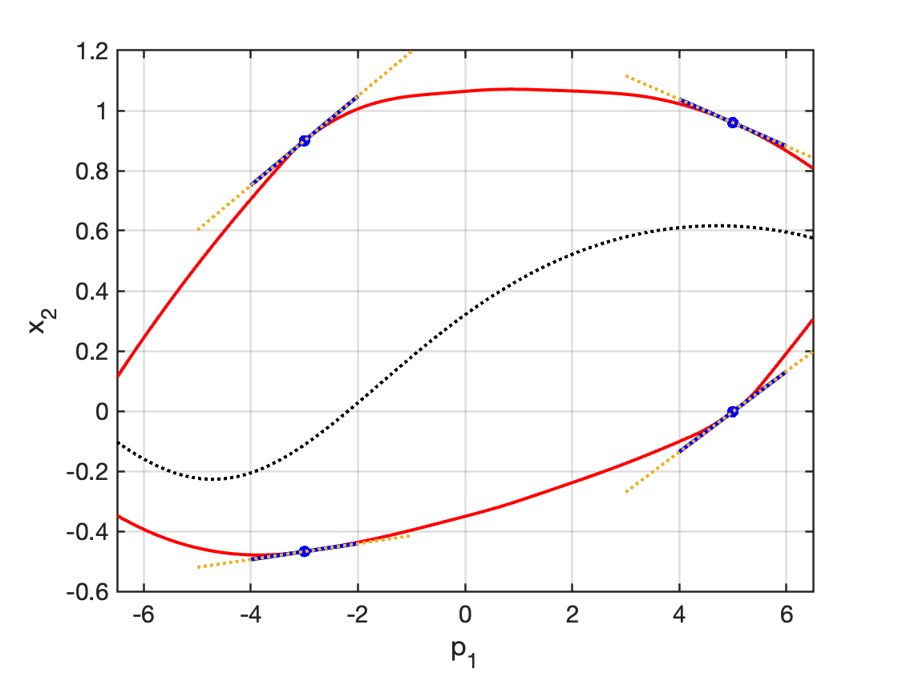
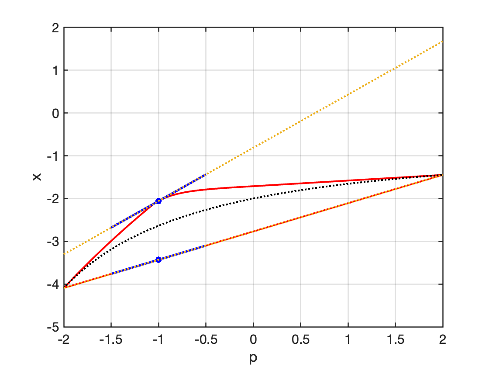
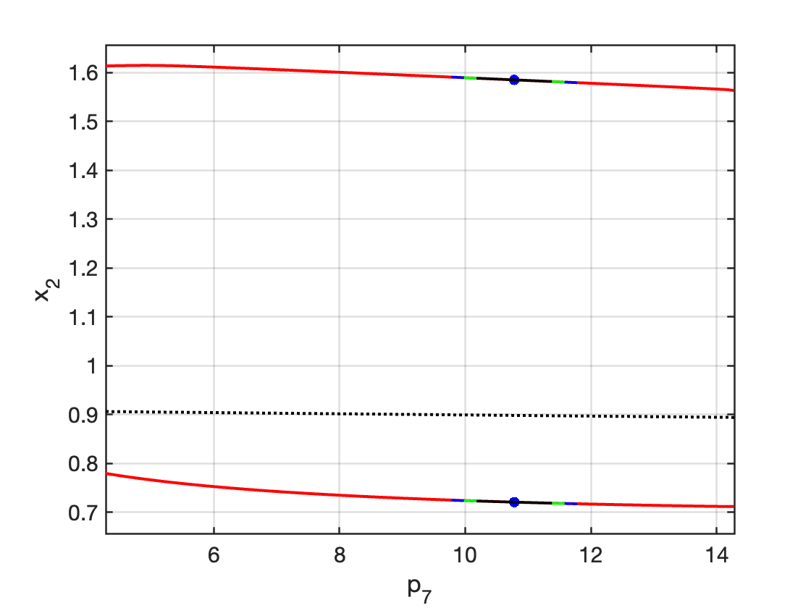

# continuous-convex-adjoints

Sensitivity analysis for convex relaxations is useful in typical convex minimization methods for global optimization. Consider a nonlinear dynamic optimization problem with an embedded system of parametric ordinary differential equations (ODEs). Here $\mathbf{p} \in P$ denotes system parameters, $\mathbf{x}$ denotes state variables that solve an ODE system over the time horizon $I:=
[t_0,t_f]$. $J: \mathbb{R}^{n_p}\rightarrow\mathbb{R}$ is an objective function based on a cost function $g: I \times P \times \mathbb{R}^{n_x} \rightarrow \mathbb{R}$.

$$
\begin{align*}
\min_{\mathbf{p} \in P} \quad & J(\mathbf{p}) := g(t_f,\mathbf{p},\mathbf{x}(t_f,\mathbf{p}))\\
\mathrm{s.t.}\quad &\dot{\mathbf{x}}(t,\mathbf{p})=\mathbf{f}(t,\mathbf{p},\mathbf{x}),\quad \forall t\in(t_0,t_f],\\
&\mathbf{x}(t_0,\mathbf{p})=\mathbf{x}_0(\mathbf{p}).
\end{align*}
$$

To construct the convex relaxations of solutions of the parametric ODE system, we consider the generalized McCormick relaxations developed by [Scott and Barton (2013)](https://link.springer.com/article/10.1007/s10898-012-9909-0). These relaxations of ODE solutions, known as state relaxations, solve the following auxiliary parametric ODE system:

$$
\begin{align*}
    &\dot{\mathbf{x}}^{\mathrm{cv}}(t,\mathbf{p}) =
    \mathbf{f}^{\mathrm{cv}}(t,\mathbf{p},\mathbf{x}^{\mathrm{cv}}(t,\mathbf{p}),\mathbf{x}^{\mathrm{cc}}(t,\mathbf{p})), &
    \mathbf{x}^{\mathrm{cv}}(t_0,\mathbf{p})&=\mathbf{x}_0^{\mathrm{cv}} (\mathbf{p}), \\
    &\dot{\mathbf{x}}^{\mathrm{cc}}(t,\mathbf{p}) =
    \mathbf{f}^{\mathrm{cc}}(t,\mathbf{p},\mathbf{x}^{\mathrm{cv}}(t,\mathbf{p}),\mathbf{x}^{\mathrm{cc}}(t,\mathbf{p})), &
    \mathbf{x}^{\mathrm{cc}}(t_0,\mathbf{p})&=\mathbf{x}_0^{\mathrm{cc}} (\mathbf{p}).
\end{align*}
$$

Given Scott and Barton's state relaxations, we consider the following convex relaxation of the nonlinear dynamic optimization problem:

$$
\begin{align*}
    \min_{\mathbf{p}\in P} \quad & J^{\mathrm{cv}}(\mathbf{p}) := g^{\mathrm{cv}}(t_f,\mathbf{p},\mathbf{x}^{\mathrm{cv}}(t_f,\mathbf{p}),\mathbf{x}^{\mathrm{cc}}(t_f,\mathbf{p})),\\
\end{align*}
$$

where $J^{\mathrm{cv}}$ is a convex relaxation of $J$, constructed by composing a generalized McCormick
relaxation (Scott and Barton, 2013) $g^{\mathrm{cv}}$ of $g$ with state relaxations $(\mathbf{x}^{\mathrm{cv}},\mathbf{x}^{\mathrm{cc}})$.

This repository contains a proof-of-concept implementation of a new adjoint subgradient evaluation approach (Song and Khan, 2023), where the subgradients of $J^{\mathrm{cv}}$ can be evaluated without
constructing full generalized derivatives of Scott and Barton's relaxations. This repository contains our C++ and Julia code for all numerical examples in our accompanying manuscript:

> Zhang, Y., Khan, K.A., 2023. Evaluating subgradients for convex relaxations of dynamic process models by adapting current tools, *Computers and Chemical Engineering*. Under revision.

This implementation was developed by Yulan Zhang in C++ and Julia. This repository is tied to the accompanying article, and will not be updated except for bug fixes. If you make use of this code, please cite our article as above.
 
This work was supported by the Natural Sciences and Engineering Research Council of Canada (NSERC) under Grant RGPIN-2017-05944.

## Dependencies
[CVODES](https://computing.llnl.gov/projects/sundials/cvodes) v5.8.0

[MC++](https://github.com/coin-or/MCpp) v1.0

## Method outline
Song and Khan (2023) describe a new subgradient evaluation framework for the two established state relaxations ([Scott and Barton, 2013](https://link.springer.com/article/10.1007/s10898-012-9909-0); [Song and Khan, 2022](https://link.springer.com/article/10.1007/s10107-021-01654-x)). This subgradient evaluation framework computes state relaxation subgradients as solving an auxiliary ODE system that resembles classical ``forward'' sensitivity analysis results for smooth ODEs. For Scott and Barton's relaxations, the subgradient ODE system may be reformulated as an adjoint sensitivity system of the form:

$$
\begin{align*}
&\dot{\boldsymbol{\lambda}}(t) = -[\Theta_\mathrm{A}(t,\tilde{\mathbf{p}})]^{\mathrm{T}}\,\boldsymbol{\boldsymbol{\lambda}}(t),\,
&\boldsymbol{\lambda}(t_f) = \boldsymbol{\rho}^\mathrm{T}.
\end{align*}
$$

Then, the subgradient $\tilde{s}$ of $J^{\mathrm{cv}}$ at $\tilde{\mathbf{p}}$ is:

$$ 
\begin{align*} 
\tilde{\mathbf{s}} = [\mathbf{S}^{\mathrm{C}}_0]^\mathrm{T}\boldsymbol{\lambda}(t_0) + \boldsymbol{\rho} + \int\_{t_0}^{t_f} [\Theta\_{\mathrm{B}}(t,\tilde{\mathbf{p}})]^{\mathrm{T}} \boldsymbol{\lambda}(t) dt \in \partial J(\tilde{\mathbf{p}}). 
\end{align*} 
$$

The final quadrature term can be integrated simultaneously with the adjoint ODE system. To construct this adjoint subgradient evaluation system, the subgradient propagation coefficients $(\Theta_A, \Theta_B)$ must be constructed. These may be constructed by either the forward-mode automatic differentiation (AD) procedure for subgradient computation [(Mitsos et al., 2009)](https://epubs.siam.org/doi/abs/10.1137/080717341?casa_token=X6tjOHIMtuUAAAAA:YEYWjPwxVy89IxHdTtORz7-ezvmI9JVrPxtbrFeCZZI-i_HJWi2XTd3WS3boCcv_IWQULb-HjNT7Mg), or the corresponding reverse-mode AD [(Beckers et al., 2012)](https://link.springer.com/chapter/10.1007/978-3-642-30023-3_10).

## Implementation contents
The forward-mode subgradient AD (Mitsos et al., 2009) can be employed using [MC++](https://github.com/coin-or/MCpp) directly, while the reverse-mode AD (Beckers et al., 2012) is implemented by our own differentiation and code generation tools.

For the reverse-mode subgradient AD (Beckers et al., 2012), the [`/src/`](/src/) folder provides the `ReverseADforVW` module, a computational graph generation tool [CompGraphs.jl](src/CompGraphs.jl), and a variant `RevMcCormick` of [MC++](https://github.com/coin-or/MCpp)’s McCormick class. For any user-defined factorable function that is compatible with [MC++](https://github.com/coin-or/MCpp), the `ReverseADforVW` module in [ReverseMC.jl](src/ReverseMC.jl) automatically constructs its computational graph by adapting our computational graph generation module `CompGraphs` in [CompGraphs.jl](https://github.com/kamilkhanlab/collab-yz/blob/main/src/adjoint-subgradient/CompGraphs.jl), and then generates the corresponding C++ code. The class `RevMcCormick` in [revmccormick.hpp](https://github.com/kamilkhanlab/collab-yz/blob/main/src/adjoint-subgradient/revmccormick.hpp) is developed to store propagated subgradient values during the reverse AD sweep. 

The [`/examples/`](/examples/) folder contains our code for four numerical examples in the accompanying manuscript. Note that this implementation itself can construct Scott and Barton's relaxations and adjoint subgradient evaluation systems automatically for any nonlinear dynamic optimization problem with an embedded system of parametric ODEs.

### [Example1](examples/example1)
This C++ implementation calculates subgradients for an objective function in a lower-bounding problem when the adjoint system is constructed using forward-mode subgradient AD. This example is adapted from [Scott and Barton (2013)], producing the plot:

### [Example2](examples/example2)
This C++ implementation calculates subgradients for an objective function in a lower-bounding problem. The computation is performed when the adjoint system is constructed using reverse-mode subgradient AD, producing the plot:

### [Example3](examples/example3)
This implementation describes both the forward subgradient evaluation system (Song and Khan, 2023) and the adjoint subgradient system for the same lower-bounding problem, allowing for comparison in terms of CPU time. In constructing the adjoint subgradient system, we separately apply both forward-mode subgradient AD (Mitsos et al., 2009) and reverse-mode subgradient AD (Beckers et al., 2012). The resulting plot is:

### [Example4](examples/example4)
To compare how the CPU time for evaluating the subgradient of the objective function scales with the number of parameters, this implementation calculates subgradients using both the adjoint subgradient evaluation system and the forward subgradient evaluation system (Song and Khan, 2023).

## References
- Chachuat, B., 2001. MC++: a toolkit for bounding factorable functions. available at: https://github.com/coin-or/MCpp.

- Beckers, M., Mosenkis, V., Naumann, U., 2012. Adjoint mode computation of subgradients for McCormick542
relaxations, in: Recent Advances in Algorithmic Differentiation. Springer, pp. 103–113

- Hindmarsh, A.C., Brown, P.N., Grant, K.E., Lee, S.L., Serban, R., Shumaker, D.E., Woodward, C.S., 2005. SUNDIALS: Suite of nonlinear and differential/algebraic equation solvers. ACM Transactions on Mathematical Software (TOMS) 31, 363–396.

- Scott, J.K., Barton, P.I., 2013. Improved relaxations for the parametric solutions of ODEs using differential589
inequalities. Journal of Global Optimization 57, 143–176. 

- Song, Y., Khan, K.A., 2022. Optimization-based convex relaxations for nonconvex parametric systems of598
ordinary differential equations. Mathematical Programming 196, 521–565.

- Song, Y., Khan, K.A., 2023. Computing subgradients of convex relaxations for the solutions of parametric systems of ordinary differential equations. Under review.
